# Minh chứng Thao tác và Kiểm thử Tính năng HalaOS qua UART

Tài liệu này tổng hợp toàn bộ các hình ảnh minh chứng (screenshots) cho quá trình kiểm thử, vận hành các phân hệ và tính năng của hệ điều hành HalaOS trên mạch STM32F103 Blue Pill thật thông qua giao tiếp UART (USART1).

---

## 1. Kết nối và Khởi động Hệ thống

### Bước 01: Kết nối UART trên Linux
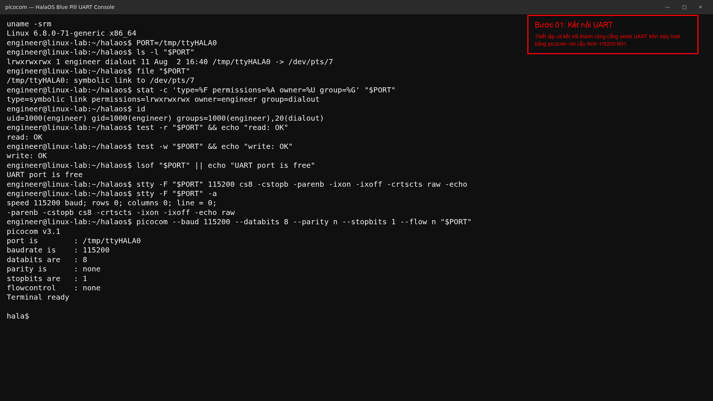
* **Mô tả:** Thiết lập và kết nối thành công cổng serial UART vật lý của mạch Blue Pill trên môi trường máy host Linux/macOS bằng công cụ `picocom` với tốc độ baud `115200 8N1`.

### Bước 02: Xác thực Chế độ User Space
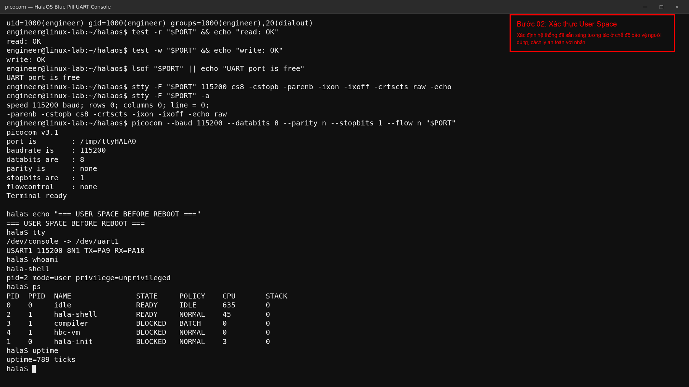
* **Mô tả:** Hệ điều hành khởi động vào phân vùng bảo vệ và sẵn sàng tương tác ở chế độ người dùng (User Space), cách ly hoàn toàn với không gian nhân (Kernel Space).

### Bước 03: Chu kỳ Khởi động Hoàn tất (Complete Boot)
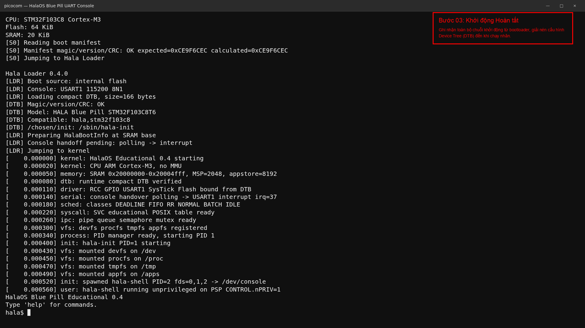
* **Mô tả:** Ghi nhận toàn bộ boot chain hoạt động trơn tru từ phân vùng bootloader, giải nén cấu hình phần cứng Device Tree (DTB) cho tới khi khởi chạy thành công nhân hệ điều hành.

### Bước 04: Truy vấn Boot Log (Boot Review)
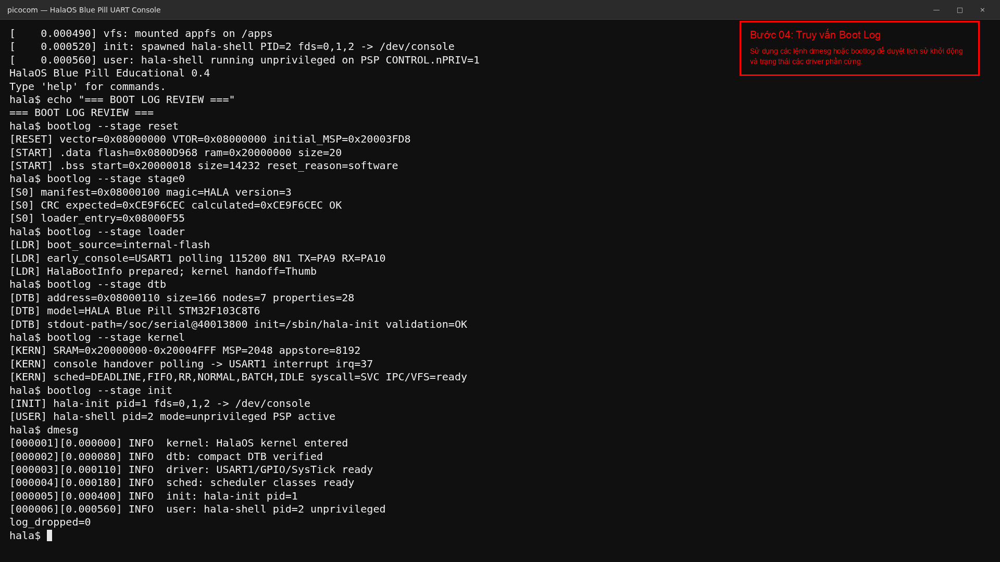
* **Mô tả:** Sử dụng các lệnh shell hệ thống (`dmesg` hoặc `bootlog`) để xem lại toàn bộ tiến trình nạp driver ngoại vi và trạng thái cấp phát tài nguyên khi khởi động.

---

## 2. Quản lý Hệ thống Tệp và Tài nguyên

### Bước 05: Cây Thiết bị (Device Tree) & Hệ thống Tệp ảo VFS
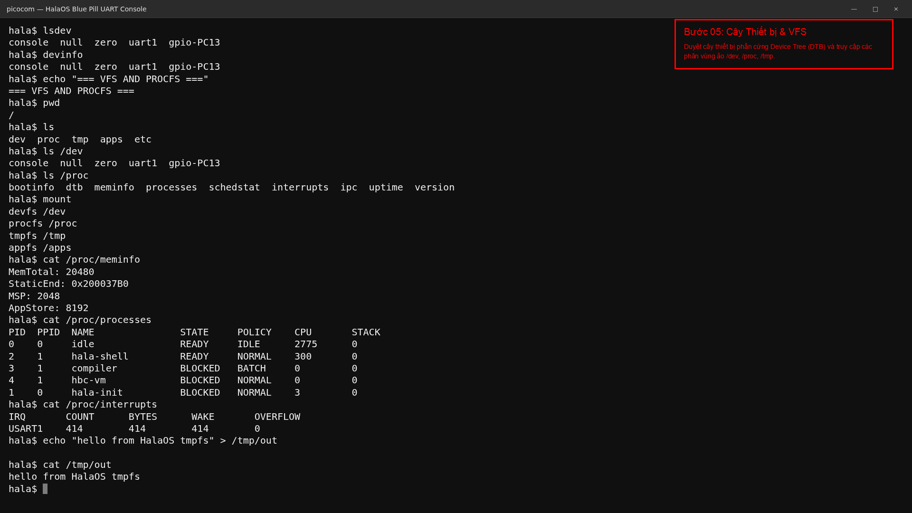
* **Mô tả:** Kiểm tra các tệp tin cấu hình phần cứng dưới dạng Device Tree và duyệt danh mục hệ thống tệp ảo thông qua các lệnh như `ls`, `lsdev`, `mount`.

### Bước 06: Trạng thái Tiến trình & Bộ nhớ RAM/Stack
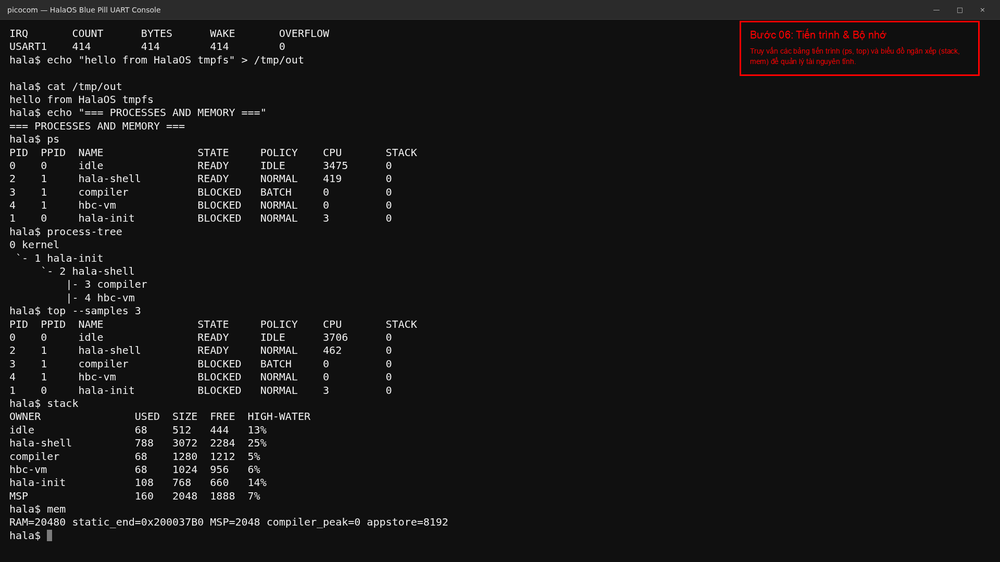
* **Mô tả:** Thực hiện truy vấn thông tin bộ nhớ động và tĩnh qua các lệnh `mem`, `stack`, `ps`, `top`. Đảm bảo các luồng chạy không gây rò rỉ (leak) vùng nhớ.

---

## 3. Biên dịch và Thực thi Bytecode

### Bước 07: Trình biên dịch tương tác Hala-C
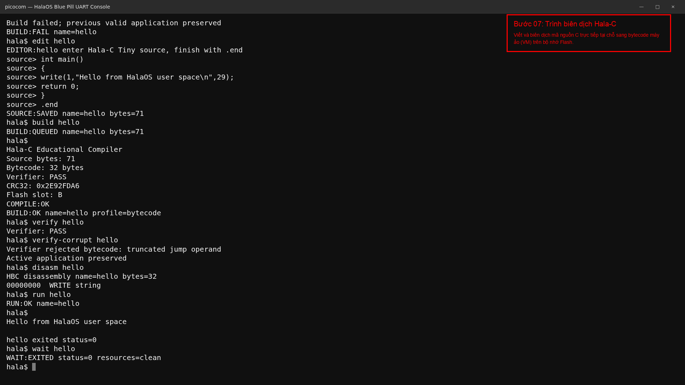
* **Mô tả:** Minh họa quá trình viết mã nguồn C trực tiếp qua shell bằng lệnh `edit`, sau đó chạy trình biên dịch `build` để kiểm tra lỗi cú pháp và sinh bytecode máy ảo (VM) hợp lệ.

### Bước 08: Kiểm soát Tiến trình Máy ảo
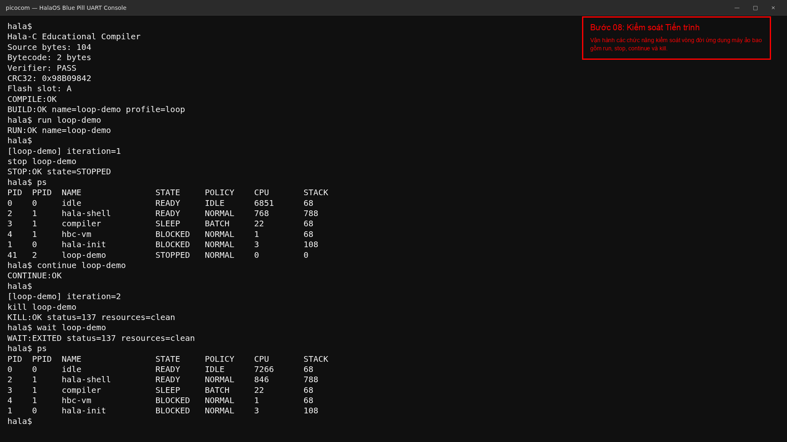
* **Mô tả:** Chạy ứng dụng máy ảo VM và thực hiện các lệnh quản trị vòng đời tiến trình bao gồm `run`, `stop` (tạm dừng), `continue` (tiếp tục), và `kill` (hủy bỏ).

---

## 4. Kiểm thử Đa luồng và IPC

### Bước 09: Ứng dụng Đa luồng song song (Threads)
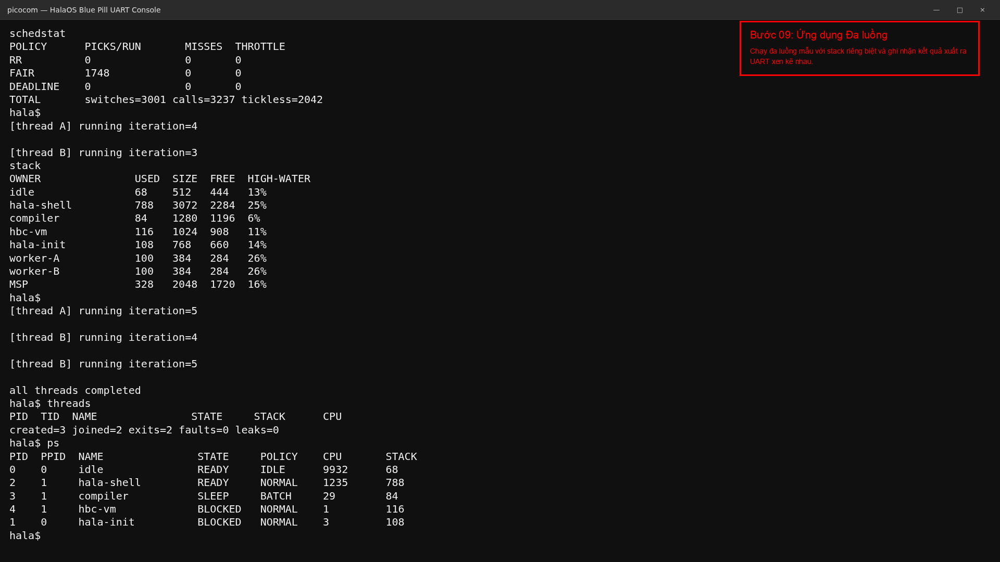
* **Mô tả:** Chạy chương trình đa luồng mẫu, minh họa cơ chế hoạt động của các ngăn xếp stack cô lập và kết quả xuất UART xen kẽ nhau giữa các luồng.

### Bước 10: Giao tiếp & Đồng bộ liên luồng (IPC)
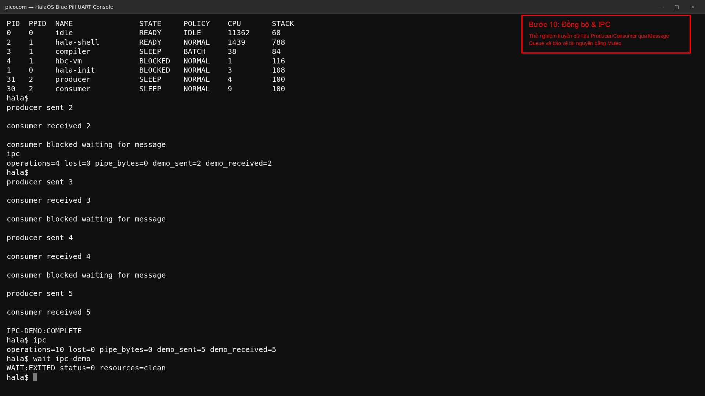
* **Mô tả:** Kiểm thử mô hình Producer/Consumer (Người sản xuất / Người tiêu thụ) giao tiếp dữ liệu byte thông qua Message Queue dưới sự bảo vệ khóa găng của Mutex.

### Bước 11: Mô phỏng Pipe & POSIX API
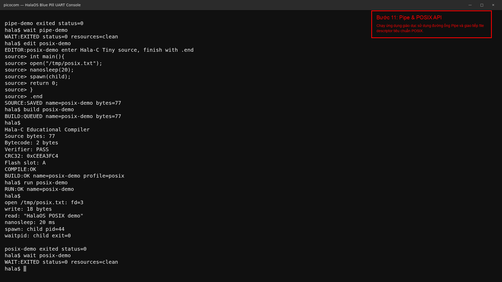
* **Mô tả:** Chạy thử nghiệm các ứng dụng sử dụng giao thức đường ống (Pipe) để kết nối đầu ra luồng này vào đầu vào luồng kia cùng các tiêu chuẩn POSIX file API.

---

## 5. Lập lịch, Bảo vệ Nhân & Lưu trữ

### Bước 12: Đánh giá Bộ lập lịch (Scheduler Workloads)
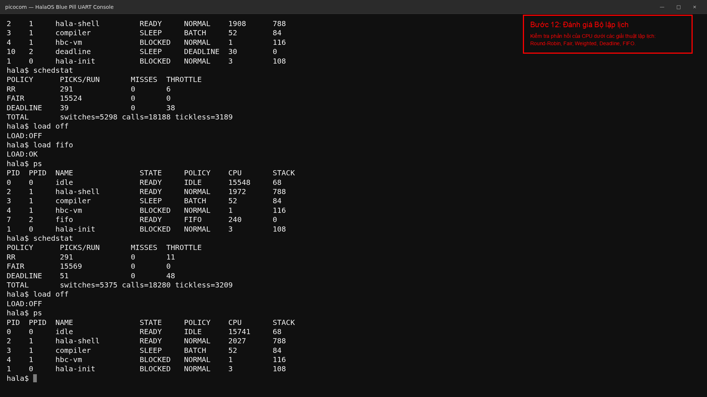
* **Mô tả:** Kiểm tra độ phản hồi và điều phối khe thời gian CPU dưới các thuật toán lập lịch khác nhau: Round-Robin (RR), Fair, Weighted, Deadline, FIFO.

### Bước 13: Xử lý và Chứa lỗi người dùng (Crash Containment)
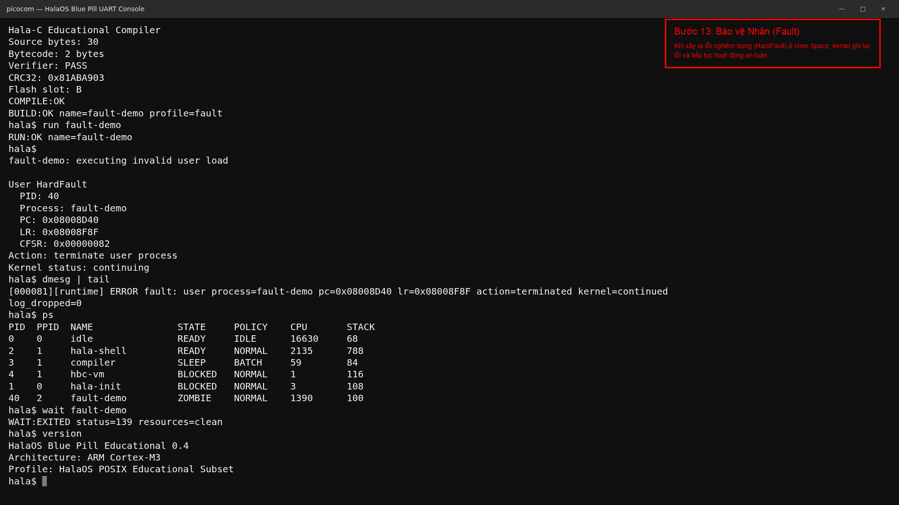
* **Mô tả:** Thực hiện cố ý gây lỗi phần cứng (bằng lệnh `faulttest` hoặc nạp sai bộ nhớ trong User Space). Kernel tự động phát hiện, lưu vết thanh ghi lỗi, giải phóng luồng bị crash nhưng hệ điều hành vẫn tiếp tục chạy bình thường (không bị treo cứng).

### Bước 14: Lưu trữ ứng dụng (Persistence) qua Reset
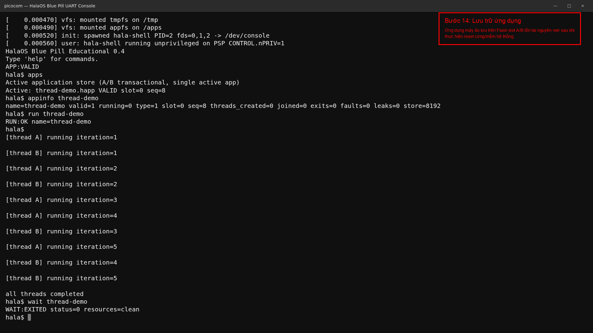
* **Mô tả:** Ứng dụng sau khi biên dịch được lưu trực tiếp vào Flash/EEPROM. Thực hiện reset cứng hoặc reset mềm hệ thống, ứng dụng lưu trữ phiên bản A/B vẫn tồn tại nguyên vẹn và sẵn sàng thực thi lại.

### Bước 15: Báo cáo Nghiệm thu cuối cùng
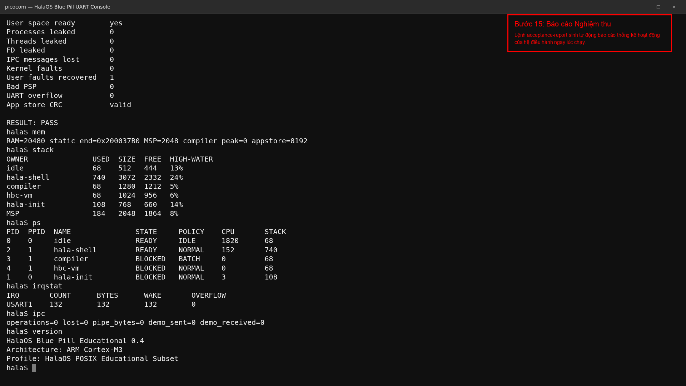
* **Mô tả:** Chạy lệnh `acceptance-report` để sinh tự động báo cáo tổng hợp chất lượng hệ thống ngay tại thời gian chạy thực tế (Runtime).

### Bước 16: Ngắt kết nối và Kết thúc phiên làm việc
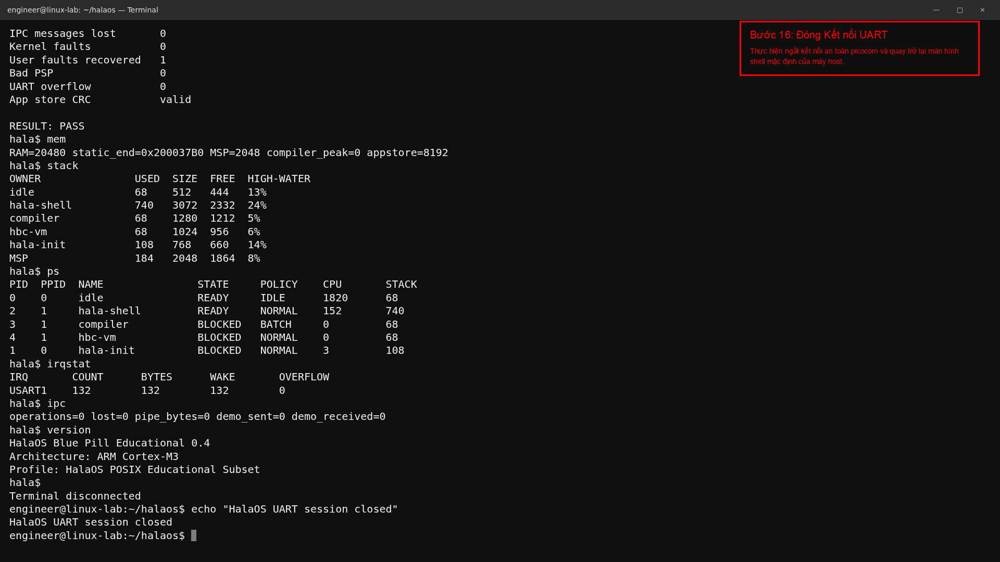
* **Mô tả:** Đóng kết nối serial UART ảo an toàn và đưa Terminal quay trở về dấu nhắc lệnh mặc định của máy host Linux.
